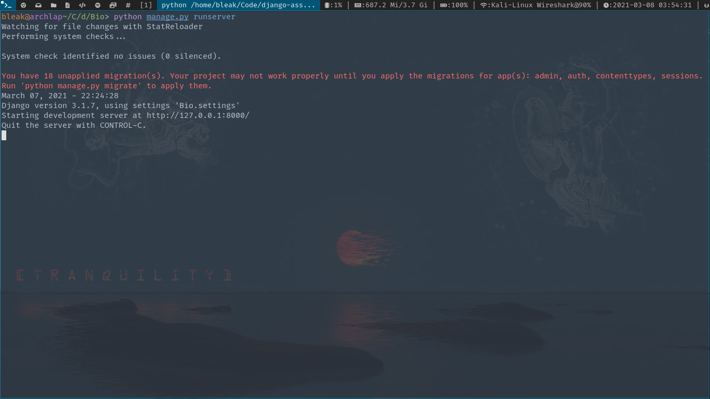
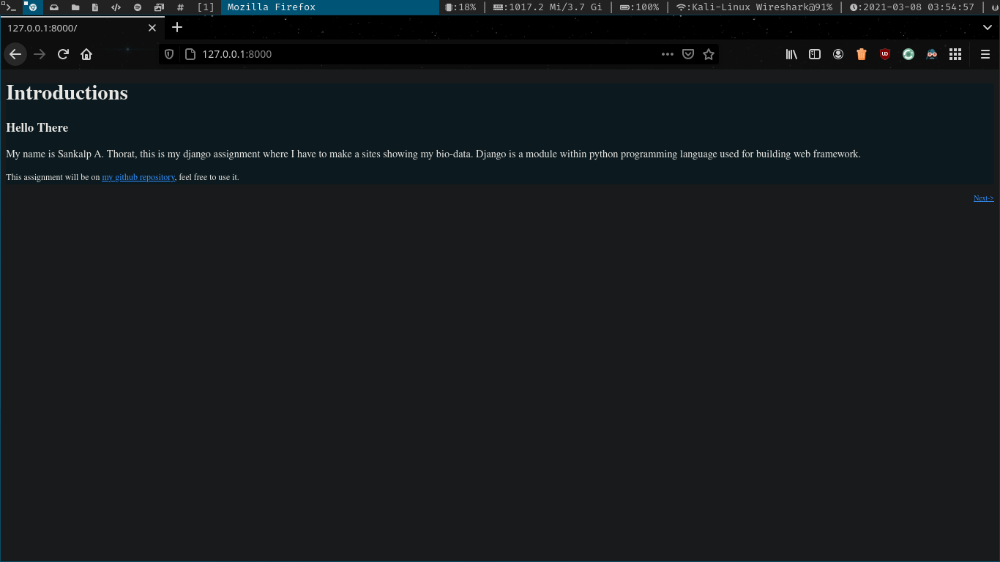
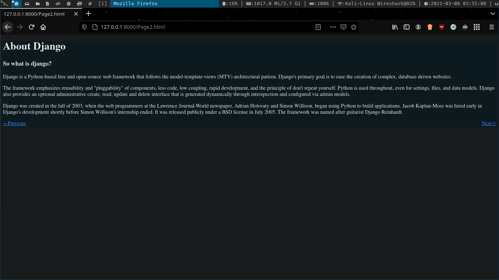
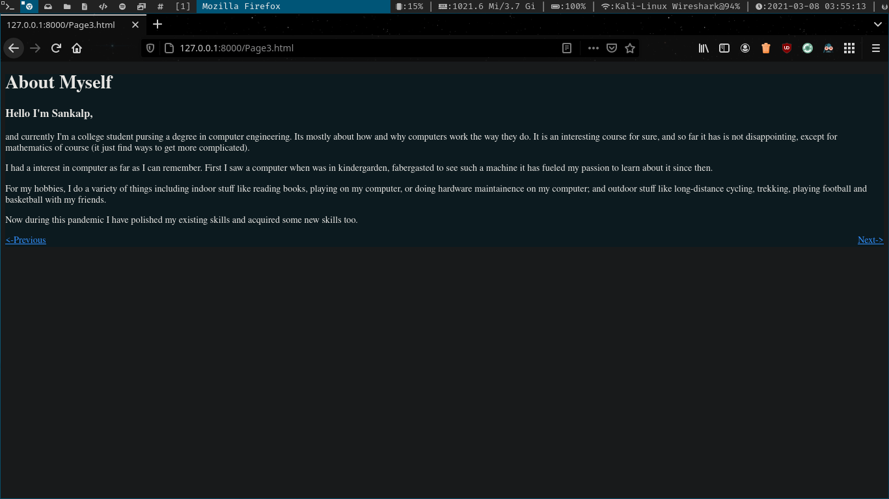
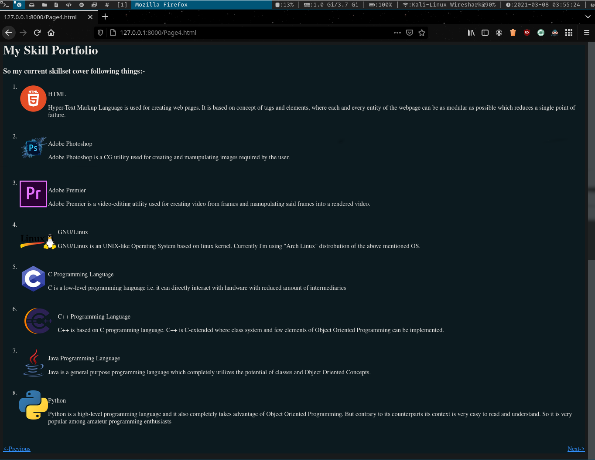
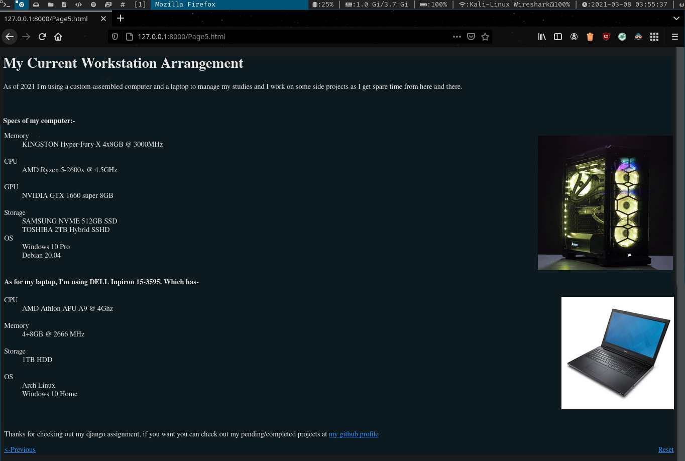

# django-assignment
It's my python's class assignment whre I have to create web-pages about myself using django module. 

### Instructions to run it on your machine
1. Clone this repository by git command:``git clone https://github.com/bleak-alpha/django-assignment.git``
2. Open into the project directory:``cd Bio``
3. Start the server:``python manage.py runserver`` 

### Screenshots

